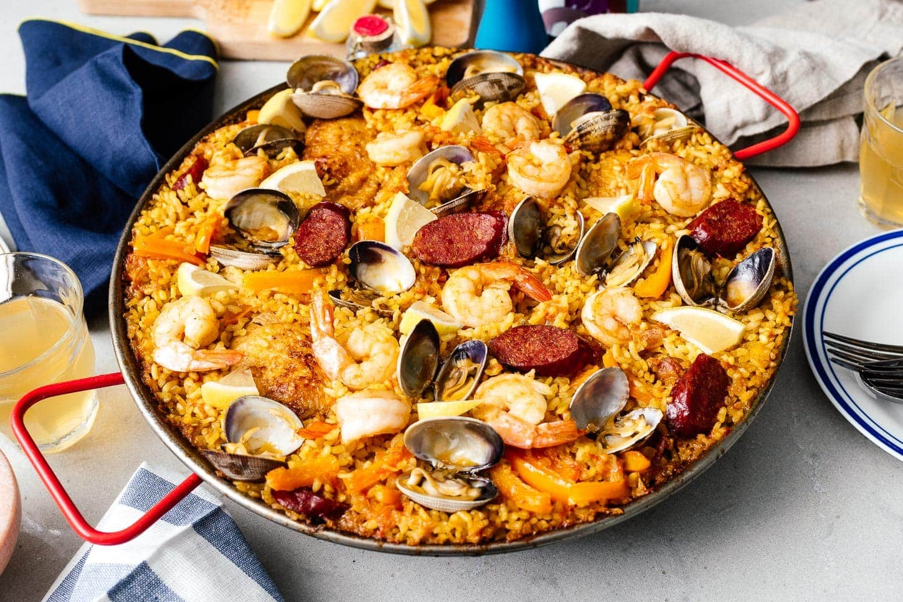

(CNN) — It's fair to say Spain was late to the table when it came to recognizing the global superpowers of food.
While Italy and France have spent years in the limelight, Spain was biding its time.
In recent years, however, people have come to celebrate the extraordinary flavors and variety of produce the cuisine has to offer.
High-profile chefs such as Ferran Adria, mastermind of the now-closed El Bulli restaurant, and the Roca brothers, founders of the El Celler de Can Roca, have brought Spain's alta cocina international acclaim.
But the heart of Spanish cooking remains in its rustic, homespun nature, a legacy of a time when hard-pressed Spaniards had to work the land for everything it would offer.
These 5 dishes -- from seafood and meat to rice and pastries -- are essential meals when you travel to Spain.
#1. Paella Valenciana
Paella is perhaps the most famous Spanish dish of all, and certainly one of the most abused. Authentic paella originates from the region around Valencia, and comes in two varieties: Paella Valenciana, with rabbit and chicken; and seafood paella.
Saffron gives the rice its color, and the base should be left to crisp into a mouth-watering black crust, called the socarrat. Always eaten at lunchtime.

#2. Patatas bravas

Foodie and gastronomical guide Diego Gil takes us on a journey to see the influences of the Moors on Spanish food.
A staple among the small dishes that make up a classic tapas menu, patatas bravas -- "brave potatoes" -- is named for its spicy sauce, rare in a land that generally shuns fiery food.
The potatoes are cubed and shallow fried and served the same everywhere. The sauce can come in any number of ways, from spicy ketchup to garlic mayonnaise with a dusting of pimiento (smoked paprika), or both.
One theory holds that the dirtier the bar, the better the bravas.

#3. Gazpacho
Is this the world's most famous cold soup?
courtesy Brindisa.com
This tomato-based Andalusian soup is most famous for being served cold. This can be quite a shock for those who aren't expecting it, but in the searing heat of a Seville summer, the attraction becomes clear.
Its principal ingredients, aside from tomato, are peppers, garlic, bread and lots of olive oil.

#4. Pimientos de Padron
A common dish on tapas menus, pimientos de Padron are green peppers that hail originally from the town of that name in Galicia, in Spain's lush, rainy northwest.
Pimientos de Padron are fried and served with a deep sprinkling of salt. Though generally sweet and mild, their fame stems from the fact that the occasional pepper will be fiery hot -- lending a Russian Roulette element of surprise to eating them.

#5. Fideuà
Less well known to tourists, fideuà is a type of Spanish pasta similar to vermicelli. It's popular in Catalonia and Valencia in seafood dishes that rival paella for their taste and intricacy.
Fideuà is typically cooked in a paella dish.

